# Sigma Studio v2.0 + Enterprise ELK SIEM

**Discover • Convert • Deploy • Tune • Repeat**

Enterprise detection engineering platform built on a production ELK SIEM. Sigma Studio converts vendor-agnostic Sigma rules to native SIEM queries, deploys them via API across Elastic and Splunk, and manages the full detection lifecycle from a single Python CLI.

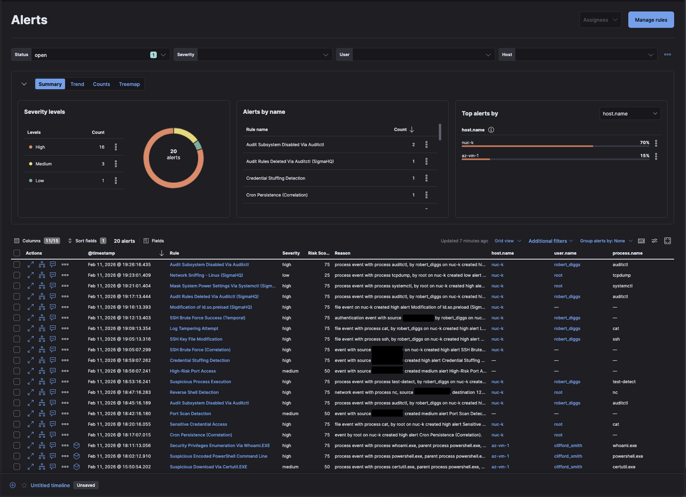

*Detection rules firing in production across Elastic and Splunk: SSH brute force, persistence mechanisms, credential stuffing, suspicious process execution, and more. Deployed and managed entirely from the command line.*

---

## Table of Contents

- [The Approach](#the-approach)
- [Infrastructure](#infrastructure)
- [Portfolio Backends](#portfolio-backends)
- [Rule Classification](#rule-classification)
- [Discover](#discover)
- [Convert](#convert)
- [Deploy](#deploy)
- [Tune](#tune)
- [Detection Rule Portfolio](#detection-rule-portfolio)
- [Security Operations](#security-operations)
- [Engineering Challenges](#engineering-challenges)
- [ELK Health Check](#elk-health-check)
- [Key Achievements](#key-achievements)
- [What This Demonstrates](#what-this-demonstrates)
- [Tech Stack](#tech-stack)
- [Contact](#contact)

---

## The Approach

One of the tricks of the current job market is proving problem-solving on an institutional level. I put myself in the shoes of an MDR provider with clients running managed SIEMs and designed Sigma Studio with a "Client 1" model.

LightworksDevCo is the first client: multiple SIEM backend configurations (ELK + Dockerized Splunk), multiple indices, client-specific rule tuning. The system is designed for additional clients, additional backends, and additional configurations. If there's a pySigma backend and pipeline, the system is extensible.

---

## Infrastructure

- **ASUS NUC Pro 12:** Always-on Kali Linux server running ELK 8.x (Filebeat, Elasticsearch, Kibana, Auditbeat)
- **Azure VM:** Ships Windows event logs to ELK for cross-platform rule testing
- **Dockerized Splunk Enterprise:** Test environment on the NUC for multi-SIEM deployment validation
- **DuckDB:** Powers Discover by querying SigmaHQ's 3,000+ community rules installed as a git submodule
- **PostgreSQL:** Manages overlay configuration, client settings, and deployment tracking
- **Tailscale VPN:** Connects all devices with network access controls
- **Python CLI + Bash wrapper:** Sigma Studio's primary interface

---

## Portfolio Backends

| Backend | Status | Notes |
|---------|--------|-------|
| **Elastic** (Lucene, ES\|QL, EQL) | Production | Tested against my live pipeline. I have rules deployed in all three query languages. |
| **Splunk** (SPL) | Test Environment | Docker container on nuc-k for API-driven alert creation and validation. |
| **Chronicle** (YARA-L) | Conversion | pySigma backend for multi-platform translation and testing. |
| **Sentinel** (KQL) | Conversion | pySigma backend for multi-platform translation and testing. |
| **LogScale** (LogScale QL) | Conversion | pySigma backend for multi-platform translation and testing. |

Sigma backend and pipeline handling is tricky. Some platforms have Windows-only support, Elastic has multiple query languages with separate backend classes, and at the time of this writing only Splunk and Elastic support chained correlation rules. The system accommodates these asymmetries. When correlation support arrives for additional backends, you update the DB configuration and redeploy.

---

## Rule Classification

Every rule's deployment class is determined dynamically at runtime, not declared in the YAML. The rule stays portable; the system figures out the rest.

| Class | What It Means | When Applied |
|-------|---------------|--------------|
| **pySigma** | Clean translation through pySigma with a field-mapping pipeline (e.g., ECS for Elastic, CIM for Splunk). No overlay modifies the output. | Target state for every rule long-term |
| **pySigma+** | pySigma translation *plus* DB overlay tuning: thresholds, custom scheduling, index overrides, exclusion filters, alert suppression | Tuning and client configuration |
| **pySigma*** | pySigma translation *without* a field-mapping pipeline. Query works syntactically but field names may not match the target schema. | Warning tier for cross-platform pipeline gaps |
| **Correlation** | Multi-event aggregation resolved into backend-native syntax (ES\|QL or SPL) with linked base rules | Rules with correlation keys |
| **Correlation+** | Correlation *plus* DB overlay tuning: schedule overrides, index overrides, tags | Tuned correlation deployments |
| **Override** | pySigma bypassed entirely. Hand-written query deployed as-is. For patterns pySigma cannot generate, like EQL temporal sequences. | Full custom handling when Sigma won't cooperate with intent |

---

## Discover

I needed a way to search the 3,000+ rules in the SigmaHQ community repository. Discover extracts a pandas DataFrame and queries it with DuckDB, filterable by MITRE technique, tactic, platform, severity, service, keywords, and rule UUID. Results are paginated, and you can stage rules directly to a drafts folder for review before adoption.

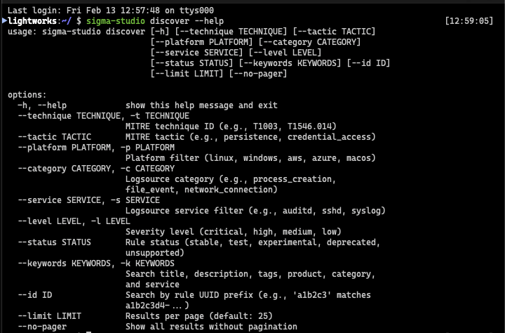

*Full search interface with MITRE technique, tactic, platform, category, service, severity, status, and keyword filtering.*

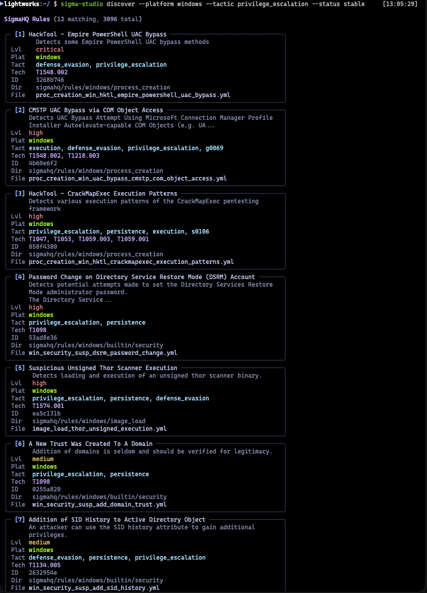

*Searching SigmaHQ for Windows privilege escalation rules. Results show title, severity, MITRE tags, platform, directory path, and file location.*

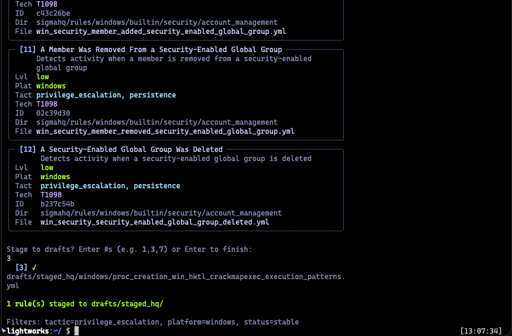

*Staging rules from search results directly into the drafts folder for review. Enter rule numbers at the prompt and they're copied into your working directory.*

---

## Convert

The convert command translates Sigma YAML to native query languages across all portfolio backends simultaneously. A `--file` flag shows pure pySigma translation with canonical field mappings. A `--client` flag layers in the client's backend profile and overlay configuration, skipping backends not in the client's scope. Any active overlays (thresholds, overrides, scheduling) appear below the translation grid.

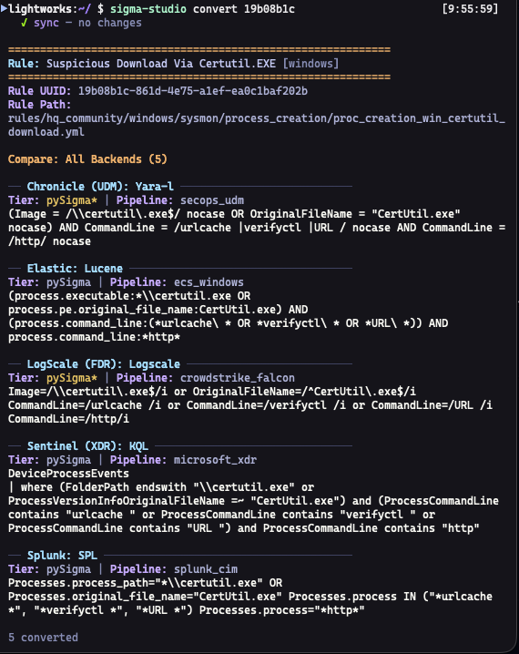

*A single Windows rule (Suspicious Download Via Certutil.EXE) translated to all 5 backends. Note the `pySigma*` tier: no field-mapping pipeline exists for some of these platforms, so the output uses source field names. The asterisk is your signal to verify field compatibility.*

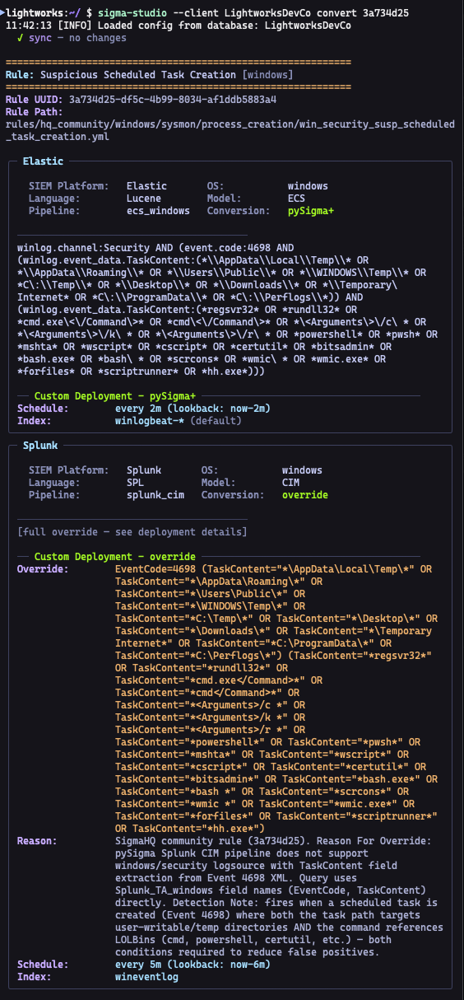

*Client-specific conversion for a Windows Scheduled Task rule. The top grid shows each backend's translation. Below it, the active pySigma+ and Override deployment details: query language, schedule, index pattern, and deployment reason.*

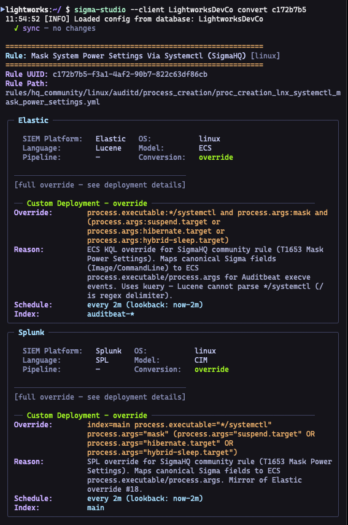

*A Linux community rule (Mask System Power Settings) with active Override deployments on both Elastic and Splunk. The override reason explains why pySigma was bypassed: canonical Sigma field mappings don't map cleanly to ECS `process.executable`/`process.args` for Auditbeat events. Each backend gets its own hand-written query, independently tuned.*

---

## Deploy

When a deployment is triggered, the system doesn't just push rules. It determines which rules are eligible through a series of gates: deduplication against existing deployments, building-block suppression for correlation base rules, backend compatibility checks, and per-platform filtering. A Linux syslog rule won't attempt deployment to a backend configured for Windows only. Each backend gets its own conversion, its own health check, and its own overlay resolution.

The same rule can deploy as Lucene to Elastic and SPL to Splunk in a single invocation, each with independent tuning.

### Before: Clean Slate

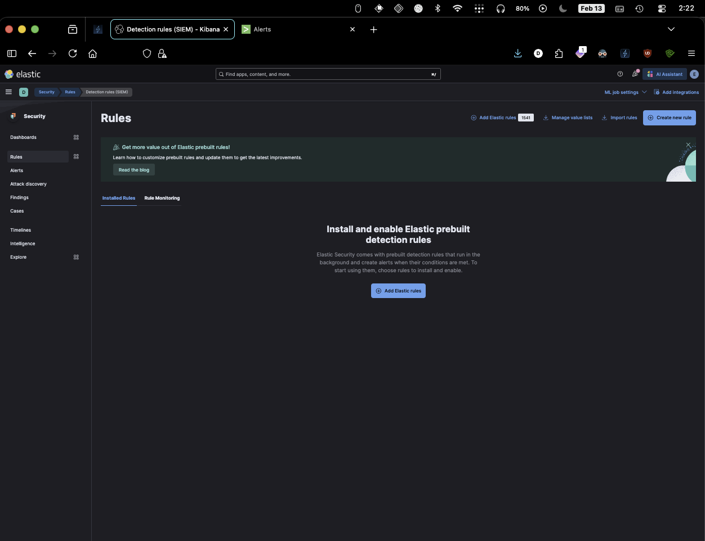
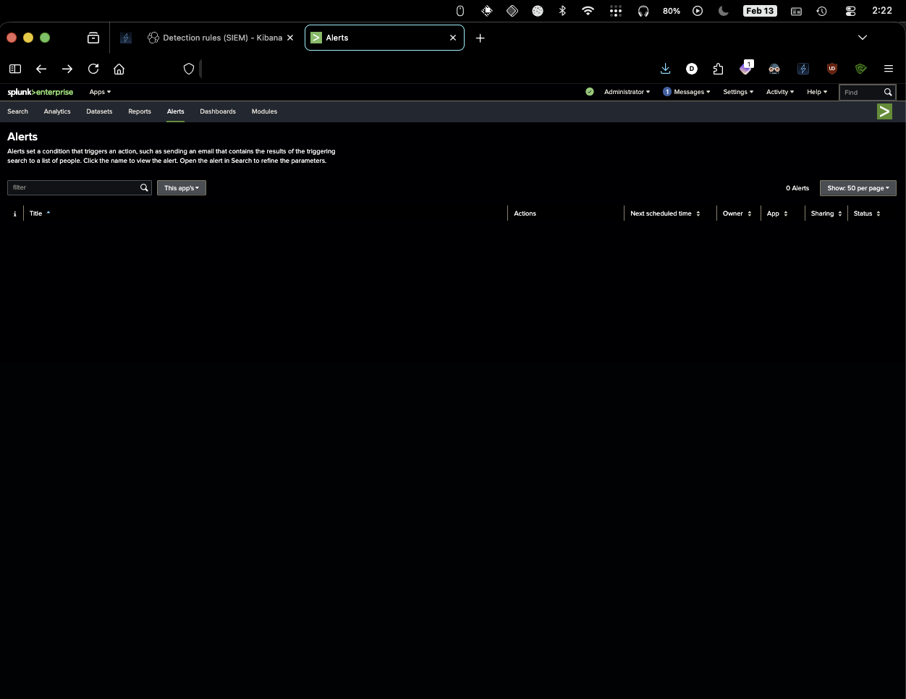

*Empty detection rule pages on both Elastic Security and Splunk Enterprise. No custom rules deployed.*

### `deploy --client LightworksDevCo --all-rules --all-backends`

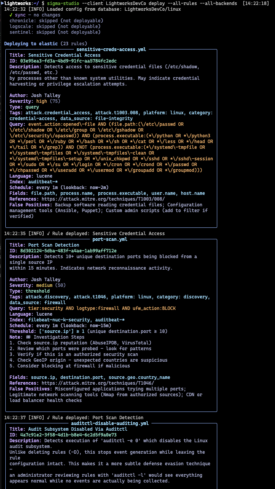

*Rules deploying across both backends. Each rule is classified at runtime, converted to the target query language, and pushed via API. Correlation base rules (building blocks) are held back automatically.*

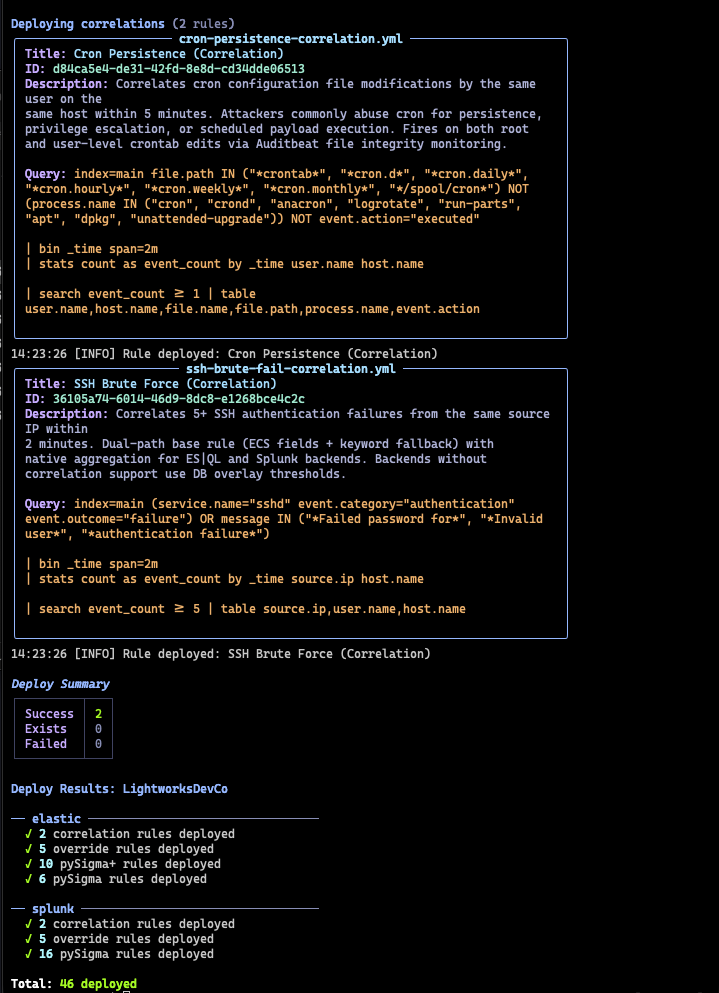

*Correlation rules deploy with their base rules linked. The system resolves correlation chains, converts to backend-native aggregation (ES|QL for Elastic, SPL for Splunk), and deploys the complete detection logic.*

### After: Rules Live

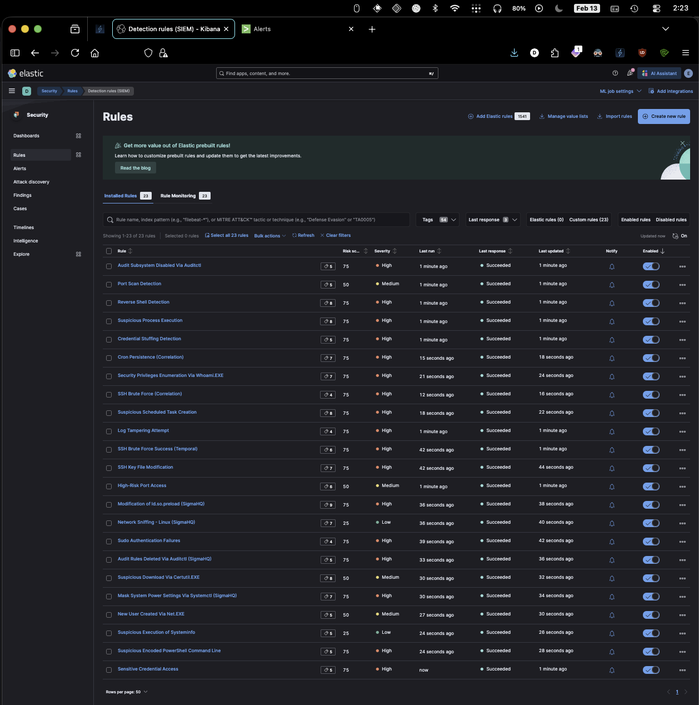

*Kibana Detection Rules populated with custom rules across Lucene, ES|QL, and EQL query types, all deployed via API.*

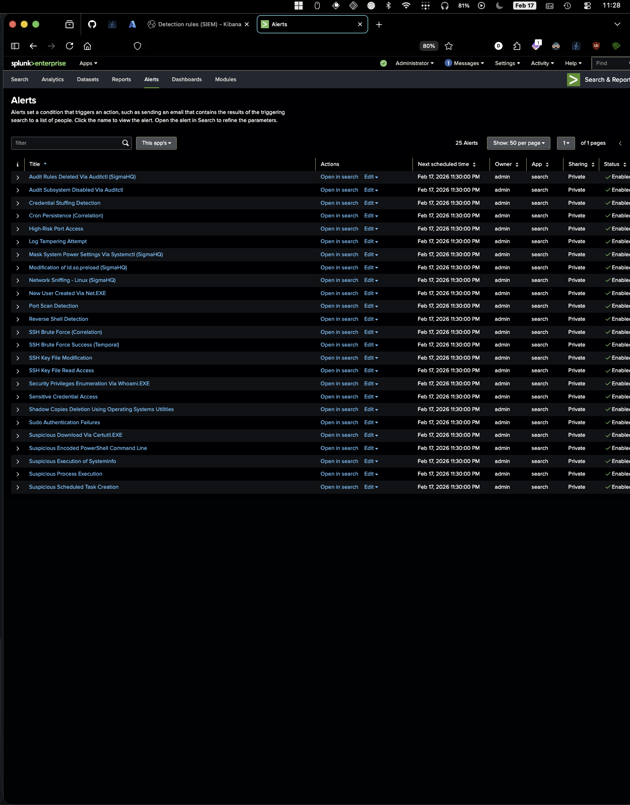

*Splunk Enterprise Alerts populated with the same detection portfolio, translated to SPL.*

### Lifecycle Management

Full lifecycle support: deploy, update, and delete with a single command.

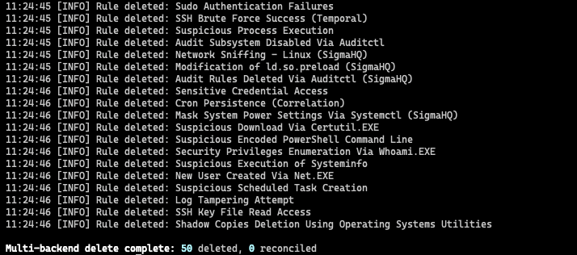

*`delete --all-rules --all-backends` removes rules across both platforms with full reconciliation. Every rule tracked, every deployment recorded.*

---

## Tune

Tuning happens through overlays: database-stored configuration that modifies how a rule deploys without touching the portable Sigma YAML. Overlays can adjust thresholds, override schedules, swap index patterns, or replace the entire query with hand-written backend-native logic. The rule file stays portable. The tuning stays in the database, scoped to a specific client and backend.

This walkthrough uses the SSH Brute Force Success (Temporal) correlation rule. pySigma generates valid correlation syntax for ES|QL and SPL automatically, but the detection pattern benefits from platform-specific query languages. EQL temporal sequences on Elastic and stats-based correlation in SPL produce tighter detection logic than generic aggregation.

### Before: Raw Conversion

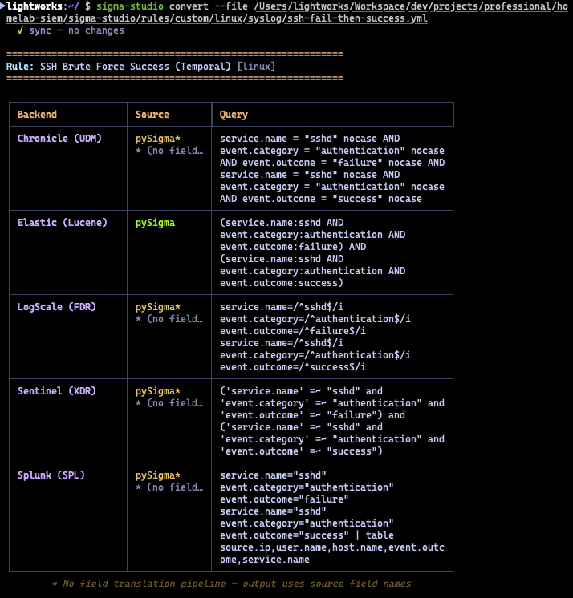

*The correlation rule converted across all 5 backends with `convert --file`. No client context, no overlays. pySigma generates correlation syntax from the portable YAML.*

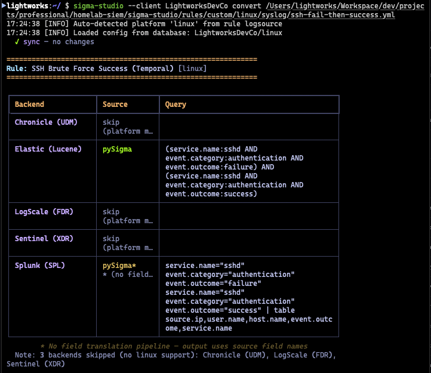

*Client-specific conversion with `convert --client`. Platform strictness skips backends not configured for Linux (Chronicle, LogScale, Sentinel). Elastic and Splunk remain in scope, but no overlays are active yet.*

### Applying Overlays

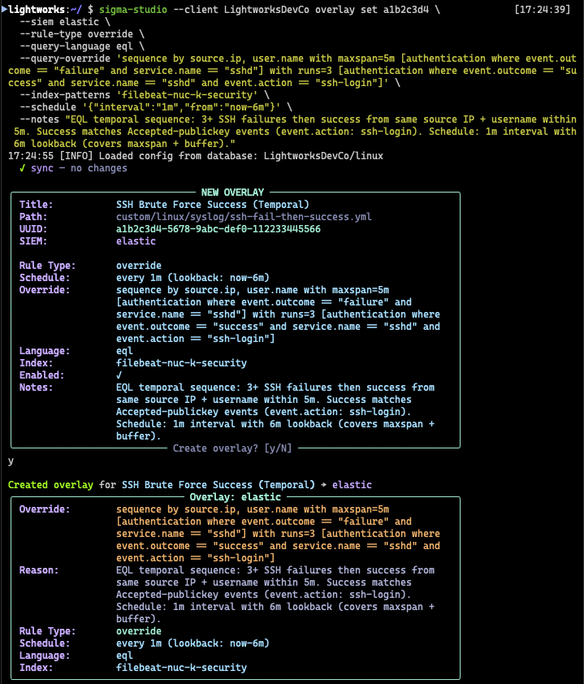

*Setting an EQL temporal sequence override for Elastic. This replaces the auto-generated ES|QL correlation with an EQL sequence query that matches SSH authentication failures followed by a successful login from the same source IP. The rule reclassifies from Correlation to Override.*

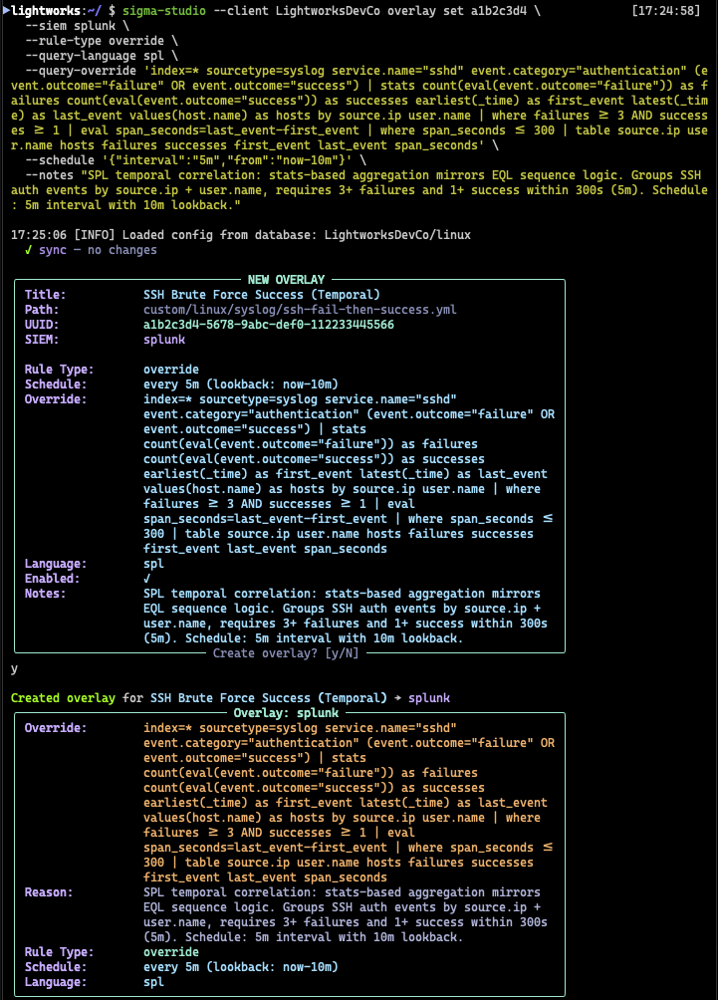

*Setting an SPL stats-based override for Splunk. Same detection intent, different query language. Each backend is tuned independently through its own overlay.*

### Deploy and Validate

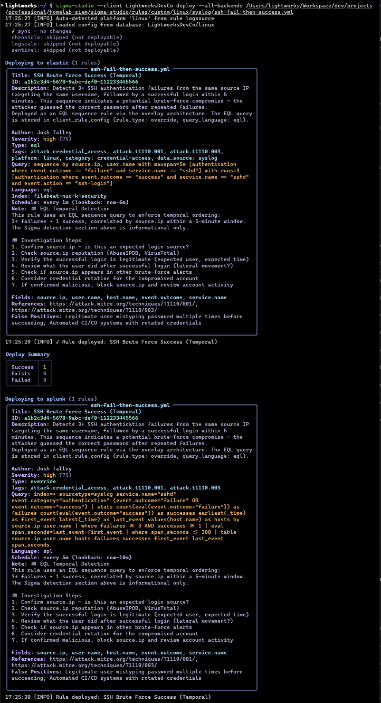
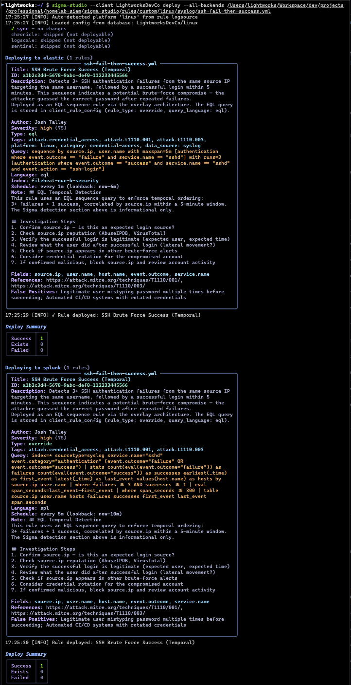

*Both backends receive the tuned rules via `deploy --all-backends`. Each deploys as Override class with the hand-written query, custom schedule, and backend-specific index pattern resolved from the overlay.*

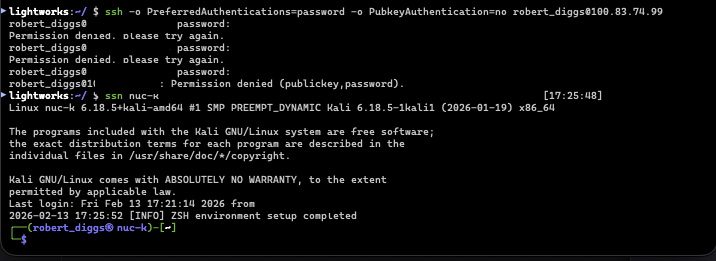

*Triggering the detection: three failed SSH password attempts followed by a successful key-based login from the same source. This matches the temporal pattern the override was written to catch.*

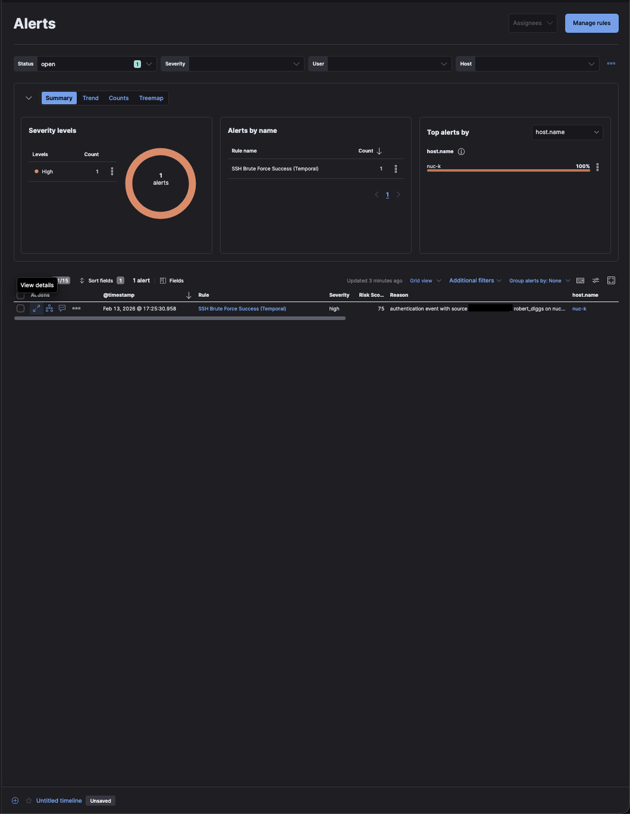

*The SSH Brute Force Success (Temporal) alert fires in Kibana Detection Alerts.*

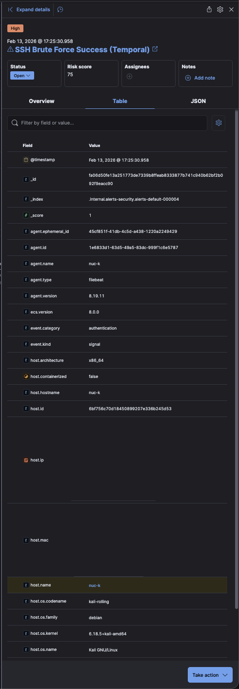

*Alert detail showing correlated event fields. The temporal sequence matched: authentication failures from a source IP, then a successful login within the configured window.*

### Overlay Lifecycle

Overlays support full CRUD operations independently of rule deployment. They can be listed, inspected, modified, and removed without redeploying.

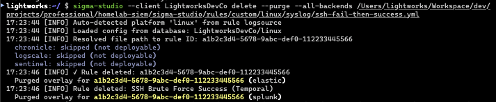

*`delete --purge` removes both the deployed rule and its overlay configuration, returning the rule to a clean slate for redeployment or reclassification.*

---

## Detection Rule Portfolio

The rule count here reflects a homelab, not a production SOC. What matters is the variety of rule types, the multi-SIEM deployment, and the architecture that manages them. The same system handles this portfolio or one ten times the size.

### Linux Detection: Custom Rules

**Network & Authentication (Filebeat)**

| Detection Rule | Type | Logic | MITRE ATT&CK |
|---|---|---|---|
| SSH Brute Force | Threshold | 5+ failures per source IP in 2 min | T1110.001, T1110.003 |
| Port Scan | Cardinality | 10+ unique ports per source IP in 15 min | T1046 |
| Credential Stuffing | Cardinality | 5+ unique usernames per source IP in 5 min | T1110.004 |
| High-Risk Port Access | Threshold | 5+ blocked connections to sensitive ports in 10 min | T1021, T1133 |
| Sudo Auth Failures | Threshold | 3+ privilege escalation failures in 5 min | T1548.003 |

**Host Activity (Auditbeat)**

| Detection Rule | Type | Logic | MITRE ATT&CK |
|---|---|---|---|
| Sensitive File Access | Query | Access to /etc/passwd, /etc/shadow by non-system processes | T1003.008 |
| SSH Key Modification | Query | Changes to authorized_keys files | T1098.004 |
| Log Tampering Attempt | Query | Deletion/truncation of audit logs, syslog, auth logs | T1070 |
| Suspicious Process Execution | Query | Binaries executed from /tmp, /var/tmp, /dev/shm | T1036 |
| Reverse Shell Detection | Query | Outbound connections from shell processes to external IPs | T1059 |

### Correlation Rules

| Detection Rule | Type | Logic | MITRE ATT&CK |
|---|---|---|---|
| SSH Brute Force (Temporal) | Correlation | 5+ SSH failures then success from same source IP in 2 min | T1110 |
| Cron Job Persistence | Correlation | 2+ cron modifications by same user/host in 2 min | T1053.003 |

*Correlation rules deploy only to backends with native aggregation support (Elastic ES|QL, Splunk SPL). Building-block base rules are automatically suppressed in multi-rule deployments to prevent alert noise.*

### SigmaHQ Community Rules (Curated)

| Detection Rule | Class | Platform | MITRE ATT&CK |
|---|---|---|---|
| Network Sniffing (tcpdump/tshark) | Override | Linux / Auditbeat | T1040 |
| Mask Power Settings Via Systemctl | Override | Linux / Auditbeat | T1564 |
| Audit Rules Deleted Via Auditctl | Override | Linux / Auditbeat | T1562.001 |
| ld.so.preload Modification | Override | Linux / Auditbeat + Splunk | T1574.006 |

*These community rules required Override classification. Canonical Sigma field mappings don't translate cleanly to ECS fields for Auditbeat kernel events. Each override includes a documented reason for the bypass.*

### Windows Rules (Cross-Platform Testing)

| Detection Rule | Class | Platform | MITRE ATT&CK |
|---|---|---|---|
| Suspicious Download Via Certutil.EXE | pySigma | Windows / Sysmon | T1105 |
| New User Created Via Net.EXE | pySigma | Windows / Sysmon | T1136.001 |
| Suspicious Scheduled Task Creation | pySigma | Windows / Sysmon | T1053.005 |
| Suspicious Encoded PowerShell Command Line | pySigma | Windows / Sysmon | T1059.001 |
| Security Privileges Enumeration Via Whoami.EXE | pySigma | Windows / Sysmon | T1033 |

*Windows rules are sourced from SigmaHQ and deployed to my Azure VM log pipeline. Up to this point the lab has been Linux-focused. These rules prove the cross-platform story and validate Windows Sysmon log translation across backends.*

### MITRE ATT&CK Coverage

18 techniques across 9 tactics: Initial Access, Execution, Persistence, Privilege Escalation, Defense Evasion, Credential Access, Discovery, Lateral Movement, and Command & Control.

---

## Security Operations

### Master Overview

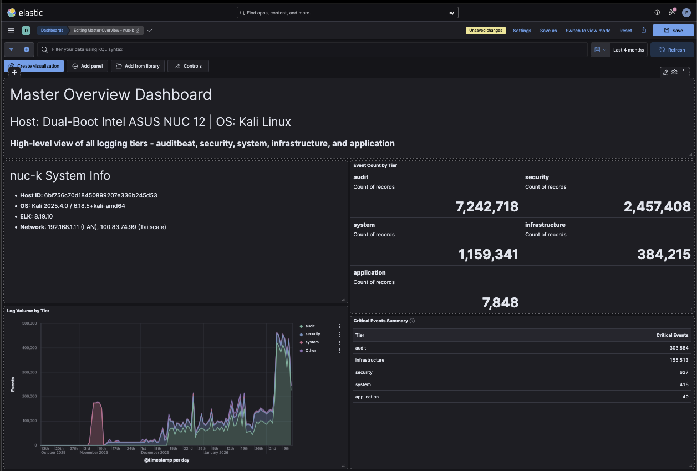

*High-level visibility across all logging tiers. ~8M events across auditbeat, security, system, infrastructure, and application streams. Real data from a production environment.*

### Security Monitoring

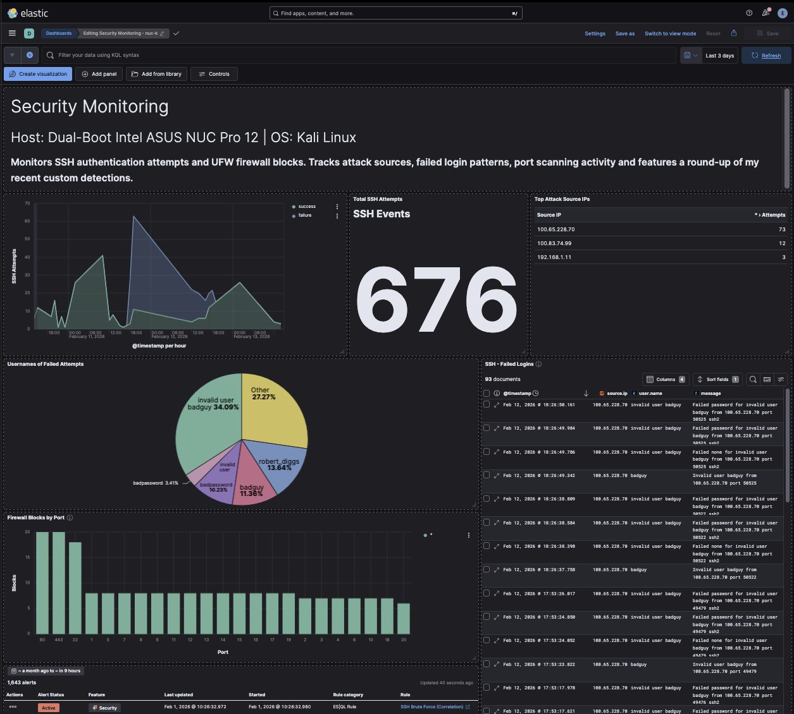

*SSH authentication patterns, attack source analysis, firewall block trends, and a live feed of detection rule alerts. This is where investigation starts.*

### Detection Rules Performance

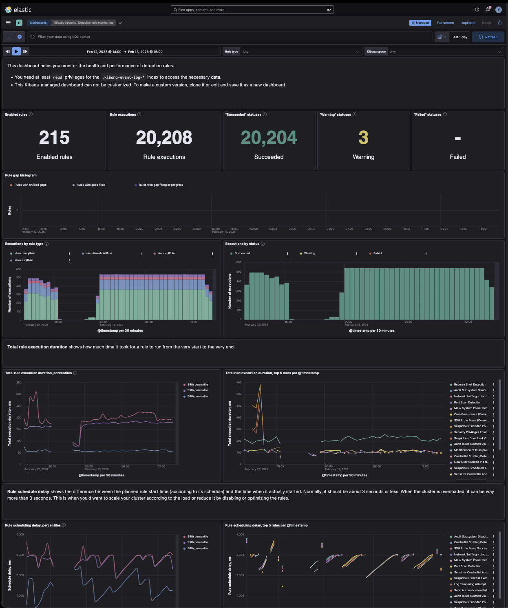

*Rule execution metrics: 20,000+ executions tracked with success rates, execution duration, and schedule delay monitoring. The 3 warnings are expected threshold rules with empty result sets during quiet periods.*

### Application Monitoring

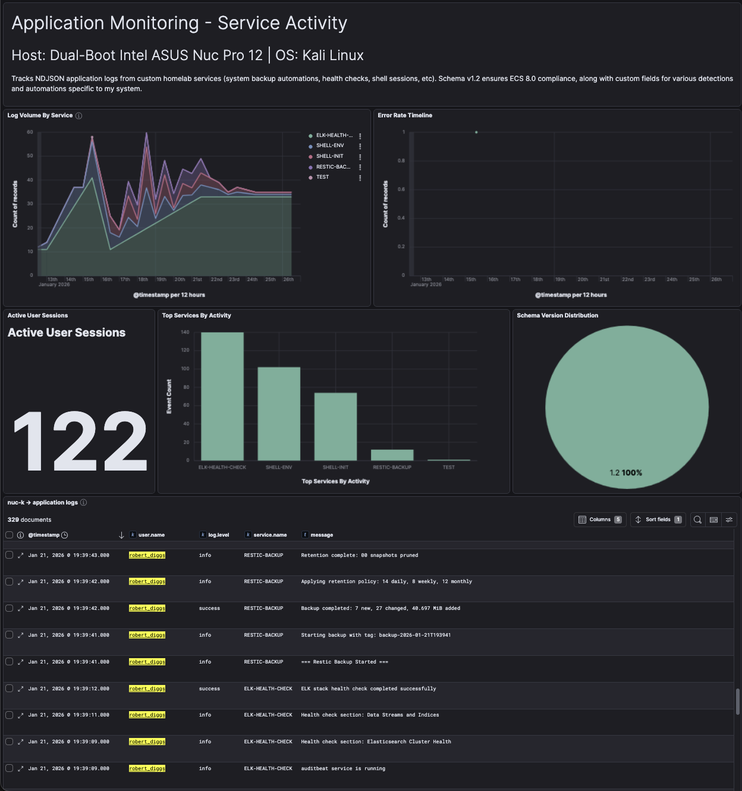

*Custom NDJSON application logs tracking service activity, session counts, and schema validation. Every log written to this tier follows the ECS 8.0 Centralized Log Style Guide I maintain for the project.*

---

## Engineering Challenges

Building a SIEM isn't plug and play. A few problems I solved along the way:

**Data Quality.** Initial deployment accumulated 44M documents, far exceeding expected volume. Investigation traced the source to Intel Meteor Lake hardware generating excessive telemetry that obscured legitimate security events. Systematic diagnosis, filter implementation, and full reindex brought the corpus to ~8M clean, actionable events with zero pipeline failures.

**IPv6 Firewall Parsing.** 28% of firewall events failed to parse. The Elasticsearch ingest pipeline expected IPv4-specific headers. Built flexible grok patterns supporting both protocols. 100% parse success rate since the fix.

**ECS Compliance.** Custom application logs used flat dotted keys violating ECS 8.0. Refactored the logging library to produce proper nested JSON. Full ECS 8.0 field compliance across all log sources.

**Auditbeat Integration.** Filebeat's auditd module drops SYSCALL, EXECVE, and PATH events, keeping only USER_*/CRED_*/LOGIN records. Deployed standalone Auditbeat with direct kernel netlink socket for complete audit coverage, plus a custom ES enrichment pipeline for tier/logtype metadata. This is why the host-based detection rules work.

**Silent SSH Event Loss.** A temporal detection rule correlating SSH brute force with successful login never fired despite verified rule logic. Investigation traced two layers of silent data loss. First, OpenSSH 9.8+ split the sshd binary into separate pre-auth and post-auth processes with different syslog identifiers; Filebeat's input filter only matched one, silently dropping all authentication events. Second, after fixing the filter, a dissect pattern captured the SSH port and key fingerprint as a single string, failing Elasticsearch's integer type check and silently rejecting the documents. Both fixes were single-line changes found through multi-stage pipeline tracing.

**Cross-Backend Query Corruption.** Multi-SIEM conversion produced identical Chronicle UDM queries from all five backends instead of native Lucene, SPL, and KQL output. Root cause: pySigma pipelines mutate the SigmaRule object during field translation. When the same object was passed through backends sequentially, the first conversion's transformations corrupted all subsequent results. Fixed by re-parsing from YAML before each backend, ensuring every conversion starts from a clean rule object. This was a portfolio-blocking bug since cross-platform query generation is one of the project's core claims.

---

## ELK Health Check

Custom health check script provides single-command visibility into the full stack: service status, authentication, cluster health, data streams, and index sizes.

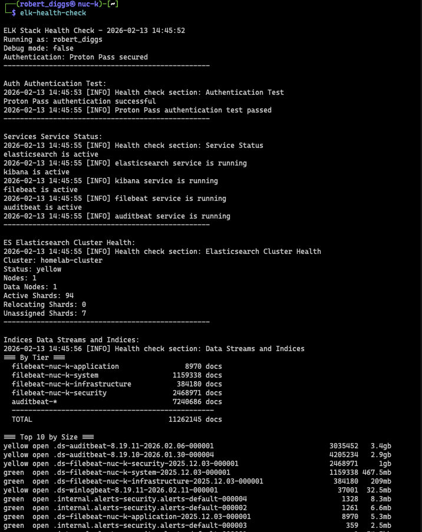

*Robert Diggs is the real-life name for the RZA. Clifford Smith is Method Man. The hostnames are a nod to Wu-Tang Clan.*

---

## Key Achievements

| Metric | Result |
|--------|--------|
| **Security Events** | ~8M processed with zero pipeline failures |
| **Detection Rules** | 25 rules across 2 SIEM platforms, 5 rule types, 6 rule classes |
| **MITRE Coverage** | 18 techniques across 9 tactics |
| **Backends** | 5 targets (2 deployed, 3 conversion) |
| **Query Languages** | Lucene, ES\|QL, EQL, SPL, KQL, YARA-L, LogScale QL |
| **ECS Compliance** | 100% across all log sources |
| **Dashboards** | 5 production dashboards, 24+ visualizations |

---

## What This Demonstrates

- **Detection engineering** across the full Sigma lifecycle: discovery, conversion, deployment, and tuning
- **Multi-SIEM architecture** targeting 5 backend platforms from a single portable rule set
- **Python tooling** with API integration (Kibana Detection Engine API, Splunk REST API, PostgreSQL, DuckDB)
- **Operational thinking** including deduplication, building-block suppression, drift detection, client isolation, overlay tuning
- **Data engineering** with ECS-compliant field mapping, ingest pipeline design, log quality management, 4-tier data stream architecture
- **Problem solving** where every engineering challenge documented above was diagnosed and resolved without outside help

This is a production security monitoring environment, not a tutorial deployment. It processes real traffic, catches actual threats, and requires ongoing tuning. Every dashboard, detection rule, and engineering decision exists because it solved a real monitoring need.

---

## Tech Stack

**Languages**
- Python (CLI application, pySigma integration, API clients)
- SQL (PostgreSQL, DuckDB)
- Bash (operational scripting, wrapper interface)

**SIEM Platforms**
- Elastic Security 8.x (Elasticsearch, Kibana, Filebeat, Auditbeat)
- Splunk Enterprise (Dockerized test environment)

**Detection**
- Sigma / pySigma (rule authoring, field mapping pipelines, backend translation)
- SigmaHQ community ruleset (3,000+ rules via git submodule)
- MITRE ATT&CK framework mapping

**Data & Storage**
- PostgreSQL (overlay configuration, client settings, deployment tracking)
- DuckDB (SigmaHQ rule search and filtering)
- pandas (DataFrame processing for Discover)

**APIs**
- Kibana Detection Engine API (rule CRUD, activation, bulk operations)
- Splunk REST API (saved search management, alert creation)

**Infrastructure**
- Kali Linux (ASUS NUC Pro 12, always-on server)
- Azure VM (Windows event log shipping)
- Docker (Splunk containerization)
- Tailscale VPN (mesh networking with ACLs)

**Query Languages**
- Lucene, ES|QL, EQL (Elastic)
- SPL (Splunk)
- KQL (Sentinel)
- YARA-L (Chronicle)
- LogScale QL (Falcon LogScale)

---

## Contact

**Joshua Talley**
- Email: josh@joshtalley.com
- LinkedIn: [linkedin.com/in/josh-talley](https://linkedin.com/in/josh-talley)
- CompTIA Security+ Certified
- Python Institute PCEP Certified

---

*Version 2.0 | February 2026*
