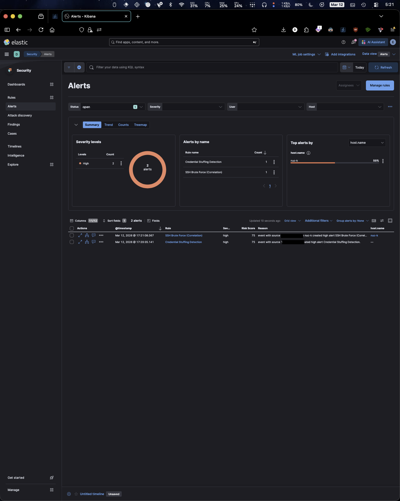
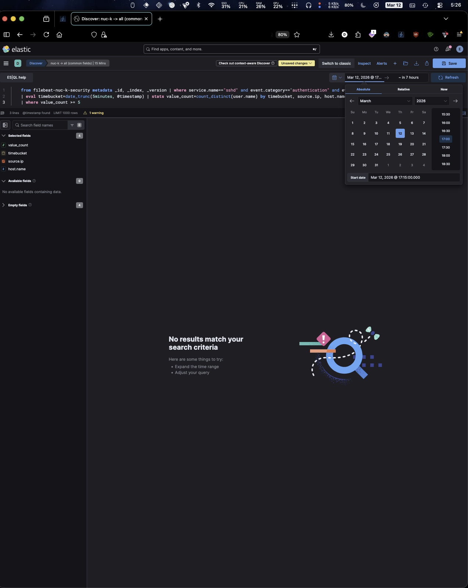
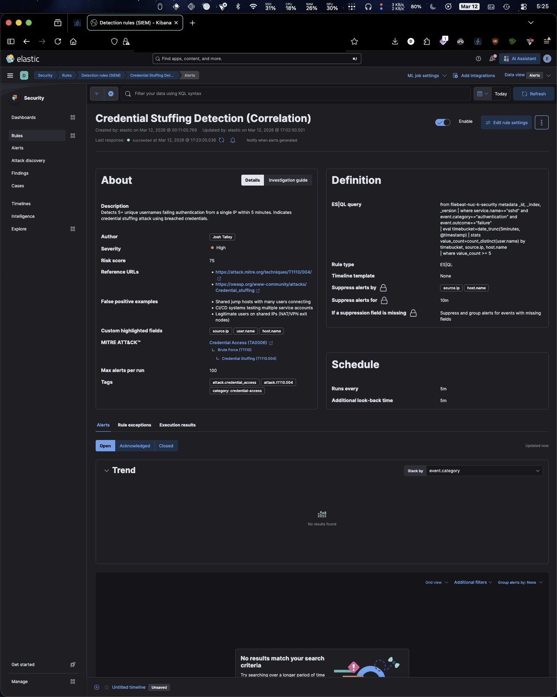
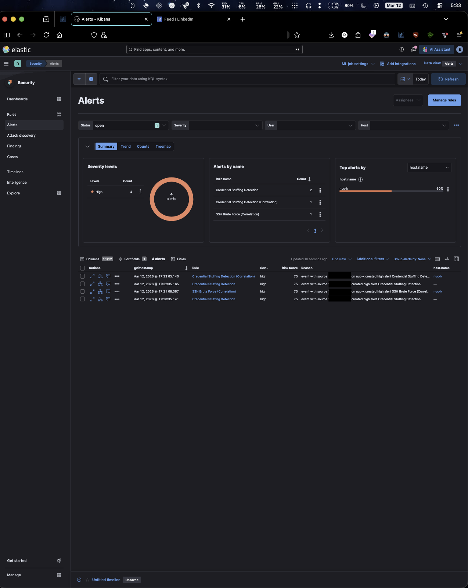
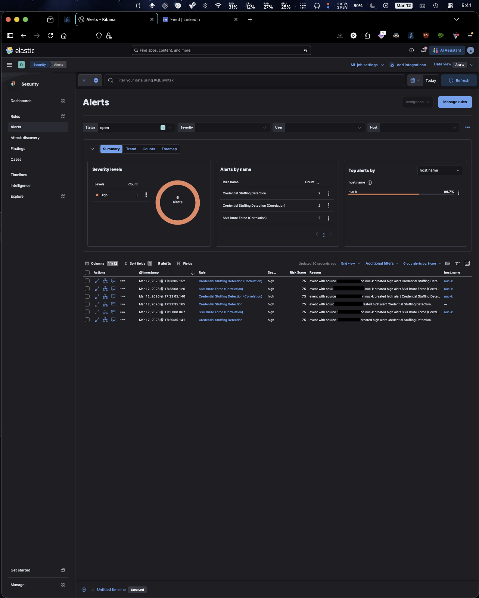
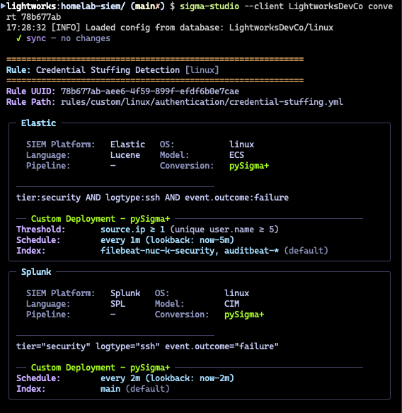

# How `date_trunc` Breaks ESQL Correlation Rules

A false-negative gap in pySigma's Elasticsearch backend that causes ESQL correlation rules to silently miss attacks straddling fixed time boundaries.

**Author**: Josh Talley  
**Date**: March 12, 2026  
**Affected Component**: `pySigma-backend-elasticsearch` v2.0.2, `elasticsearch_esql.py` lines 191-197  
**Status**: Validated, not yet reported upstream  

---

## The Short Version

pySigma generates ESQL correlation rules using `date_trunc()` for time-windowed aggregation. This creates fixed clock-aligned bucket boundaries (e.g., :00, :05, :10 for 5-minute windows) that split temporally adjacent events across buckets. When neither bucket independently meets the detection threshold, the rule fails to fire, even though the combined events clearly represent an attack.

Whether a credential stuffing attack gets detected depends on *when it happens relative to an arbitrary clock boundary*, not on whether it happened at all.

---

## Background

I built [Sigma Studio](https://github.com/josh-talley/sigma-studio-elk) to manage detection rules across multiple SIEM platforms. The pySigma ecosystem handles rule compilation. The goal is to write a Sigma correlation rule once, and the backend translates it to native queries for Elastic, Splunk, etc.

The Elasticsearch ESQL backend translates the Sigma correlation `timespan` field into a `DATE_TRUNC` call, producing queries with this pattern:

```sql
FROM filebeat-nuc-k-security METADATA _id, _index, _version
| WHERE service.name=="sshd" AND event.category=="authentication"
  AND event.outcome=="failure"
| EVAL timebucket=DATE_TRUNC(5minutes, @timestamp)
| STATS value_count=COUNT_DISTINCT(user.name) BY timebucket, source.ip, host.name
| WHERE value_count >= 5
```

The three correlation templates in the backend (`elasticsearch_esql.py:191-197`) all hardcode `date_trunc`:

```
event_count:  | eval timebucket=date_trunc({timespan}, @timestamp) | stats event_count=count(){groupby}
value_count:  | eval timebucket=date_trunc({timespan}, @timestamp) | stats value_count=count_distinct({field}){groupby}
temporal:     | eval timebucket=date_trunc({timespan}, @timestamp) | stats event_type_count=count_distinct(event_type){groupby}
```

`DATE_TRUNC(5minutes, @timestamp)` truncates every timestamp to the nearest 5-minute clock boundary (:00, :05, :10, :15, etc.). These boundaries are aligned to epoch, not to the rule's execution time or event timing.

---

## The Problem

When an attack straddles a bucket boundary, events get divided across two buckets. The aggregation runs per-bucket. If neither bucket independently meets the threshold, no alert fires.

**Credential stuffing attack = 5 unique usernames from one IP, 10-second spacing:**

| Event | Timestamp | `DATE_TRUNC(5m)` Bucket | user.name |
|-------|-----------|------------------------|-----------|
| 1 | 17:19:22 | **17:15** | badguy1 |
| 2 | 17:19:34 | **17:15** | badguy2 |
| 3 | 17:19:46 | **17:15** | badguy3 |
| 4 | 17:19:58 | **17:15** | badguy4 |
| --- | **17:20:00** | **boundary** | --- |
| 5 | 17:20:10 | **17:20** | badguy5 |

- Bucket 17:15: 4 distinct users (below threshold of 5)
- Bucket 17:20: 1 distinct user (below threshold of 5)
- **No alert fires. Attack missed.**

The same events timed to land within a single bucket fire the correlation rule every time.

---

## What I Tested

### Environment

- Elasticsearch 8.19.12, Kibana 8.19.12, Filebeat 8.19.12, Auditbeat 8.19.12 on Kali Linux
- pySigma 1.1.1, pySigma-backend-elasticsearch 2.0.2
- Sigma Studio for rule management, overlay configuration, and deployment
- Basic license (self-managed, single node)

### Test Method

Controlled SSH authentication failures using `sshpass` from a second machine over Tailscale, targeting invalid usernames:

```bash
for i in {1..5}; do
  sshpass -p 'wrong' ssh -o StrictHostKeyChecking=no -o ConnectTimeout=3 \
    "badguy${i}@nuc-k" 2>/dev/null
  sleep 10
done
```

Each iteration generates authentication failure events with a distinct `user.name`. The 10-second spacing allows precise control over which events land before vs. after a `DATE_TRUNC(5minutes)` boundary.

**Straddle test**: Start the loop ~30 seconds before a 5-minute boundary. Events 1-4 land in one bucket, event 5 in the next.

**Control test**: Start the loop well after a boundary. All events land in one bucket.

### Rules Under Test

| Rule | Type | Aggregation | Threshold |
|------|------|-------------|-----------|
| Credential Stuffing Detection (Correlation) | ESQL | `COUNT_DISTINCT(user.name)` | >= 5 |
| Credential Stuffing Detection | Threshold (Lucene) | Unique `user.name` per `source.ip` | >= 5 |
| SSH Brute Force (Correlation) | ESQL | `COUNT()` | >= 5 |

The threshold rule uses Elastic's built-in threshold rule type, which operates on a sliding window relative to execution time. No `date_trunc`, no fixed boundaries.

---

## Results

### Straddle Test (events cross a 5-minute boundary)

| Rule | Result |
|------|--------|
| Credential Stuffing Detection (Lucene, threshold) | **FIRED** |
| SSH Brute Force (ESQL, Correlation) | **FIRED** |
| Credential Stuffing Detection (Correlation) | **MISSED** |

The ESQL correlation rule using `COUNT_DISTINCT` failed to fire. The brute force correlation rule uses a 2-minute `date_trunc` window. The test events happened to fall within a single 2-minute bucket, so it fired here. The same boundary-split behavior applies to any `date_trunc` interval; a straddle test targeting 2-minute boundaries (:00, :02, :04) would produce the same miss. The Lucene threshold rule fired reliably because it uses a sliding window with no fixed boundaries.



*Alerts panel after straddle test: threshold rule and brute force correlation fired, credential stuffing correlation absent.*



*Running the exact ESQL correlation query in Discover returns zero rows because no bucket reached the threshold.*



*Correlation rule detail: rule executed successfully, produced no alerts.*

### Control Test (all events in one bucket)

| Rule | Result |
|------|--------|
| Credential Stuffing Detection (Lucene, threshold) | **FIRED** |
| SSH Brute Force (Correlation) | **FIRED** |
| Credential Stuffing Detection (Correlation) | **FIRED** |

All rules fired when events didn't straddle a boundary.



*Control test: all three rules fired when events landed in a single bucket.*



*Full alert history: straddle miss (earlier) vs. control success (later). Note the unsuppressed duplicate alerts, covered in the licensing section below.*

---

## What Does NOT Fix It

### Additional Lookback Time

Adding lookback extends the query window but does not change `DATE_TRUNC` bucket boundaries. The straddle test was run with **5m interval + 5m additional lookback** (10m total window). The query saw all the events. `date_trunc` still split them into separate buckets with per-bucket aggregation below threshold.

This is visible in the rule detail screenshots: "Runs every: 5m, Additional look-back time: 5m," and the rule still produced zero alerts.

### Non-Overlapping Schedules

Setting the rule's interval equal to the timespan (e.g., run every 5m, look back 5m) does not prevent splits. The lookback defines which documents enter the query. `date_trunc` defines internal bucket boundaries. They're independent.

### Lookback Multiplier Adjustments

Sigma Studio uses a `CORRELATION_LOOKBACK_MULTIPLIER` to add buffer time to lookback windows by default. Changing the multiplier (1.2x, 1.5x, 2x) widens the query window. Per-bucket counts remain unchanged.

---

## What Works

### Threshold Rules

Elastic's built-in threshold rule type uses a sliding window relative to each execution. No fixed boundaries, no bucket splits. It fired on every test, both straddle and control, without exception.



*The threshold rule (Lucene-based, sliding window) serves as ground truth. It detected every test reliably.*

---

## Bonus Finding: Filebeat Parser Inconsistency

During testing, I discovered that the Filebeat system module parses `user.name` inconsistently across different sshd log line formats. Each SSH connection to an invalid user generates two log lines:

1. `"Invalid user badguy1 from 192.168.1.50 port 61494"` produces `user.name: "badguy1"`
2. `"Failed password for invalid user badguy1 from 192.168.1.50 port 61494 ssh2"` produces `user.name: "invalid user badguy1"`

The generic dissect tokenizer `"%{ssh_action} for %{ssh_user} from %{ssh_source} port %{}"` captures everything between "for " and " from " as the username, which includes the "invalid user" prefix for invalid-user failure messages.

This inflates `COUNT_DISTINCT(user.name)` to 2x the actual user count, since "badguy1" and "invalid user badguy1" are counted as separate values. The inflation was masking the `date_trunc` boundary split during initial testing. Even a 3-user bucket appeared to have 6 distinct values.

**Fix**: A specific dissect tokenizer for "Failed * for invalid user" messages, placed before the generic tokenizer:

```yaml
# Parse SSH failed auth for invalid users
- dissect:
    tokenizer: "%{ssh_action} for invalid user %{ssh_user} from %{ssh_source} port %{}"
    field: "message"
    target_prefix: "ssh"
    ignore_failure: true
    when:
      contains:
        message: "for invalid user"
```

The generic tokenizer gets an exclusion condition to prevent double-matching. After applying this fix, both events produce `user.name: "badguy1"` and the `date_trunc` split was immediately provable.

---

## Elastic Licensing: Alert Suppression Theater

A note on Elastic's alert suppression, since it's relevant to anyone trying to work around `date_trunc` with overlapping windows.

Elastic's alert suppression feature deduplicates alerts when using overlapping detection windows. It requires a **Platinum license** ($6k+/year self-managed, ~$1,500+/year cloud minimum). On a Basic license, the suppression configuration fields are fully visible in Kibana. You can set `group_by` fields and durations. The settings are accepted, saved, and displayed with a small lock icon tooltip as the only indication they won't work.

At runtime, suppression is silently ignored. Every overlapping window execution that meets the threshold generates a separate alert. There is no log message, no warning banner, no degraded-feature indicator in the rule execution results.

For anyone considering overlapping windows as a `date_trunc` workaround: it works, but you're paying enterprise prices for what amounts to a deduplication filter.

---

## Implications for the pySigma Ecosystem

This is a design-level issue affecting every ESQL correlation rule generated by the Elasticsearch backend. The three correlation templates (`event_count`, `value_count`, `temporal`) all use `date_trunc` for time bucketing. Any correlation rule with a threshold condition is vulnerable to boundary-split false negatives.

The SigmaHQ blog [acknowledges](https://blog.sigmahq.io/introducing-sigma-correlations-52fe377f2527) that static time slicing is a "legitimate" backend strategy for correlation, but does not document the false-negative tradeoff. There is no upstream GitHub issue as of this writing.

### Proposed Upstream Fix

The intervention point is `elasticsearch_esql.py` lines 191-197. Replace `date_trunc` bucketing with whole-window aggregation, letting the detection engine's schedule and lookback define the time window:

```python
# Current (fixed buckets)
"| eval timebucket=date_trunc({timespan}, @timestamp) | stats ..."

# Proposed (whole-window aggregation)
"| stats ..."
```

Remove `timebucket` from the `BY` clause. The detection engine already constrains the query's time range via schedule and lookback. Internal bucketing is redundant and harmful. No legitimate detection logic depends on epoch-aligned bucketing; the current behavior silently misses attacks.

